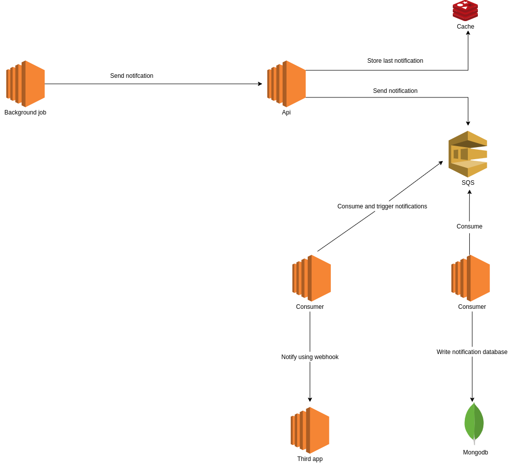

Technologies:
==============

- Go
- Redis
- SQS
- Mongodb

Architecture:
==============

About architecture:
======================

 - Focus this solution is create simple way the background job be monitored. When create job is generate link to using in background job and is one simple way use any language without implement sdk to each langague
 - I'm using Redis to store more recently data and publish data in SQS for prevent overhead write in Mongodb.
 - Create api and consumer using Golang to improving my knowedgement in this language.

Running application locally:
=================================
- Clone
- Access **api**
- Execute command **docker-compose up -d**
- Execute command **god mod**
- Create **.env** based in **.env.example** file.
- Execute command **go run main.go** to create server

- Access **fronted**
- Execute command **npm i**
- Create **.env** based in **.env.example** file.
- Execute command **npm run start** to run panel frontend

- Access **proccess-events**
- Execute command **god mod**
- Create **.env** based in **.env.example** file.
- Execute command **go run main.go** to run consumer SQS